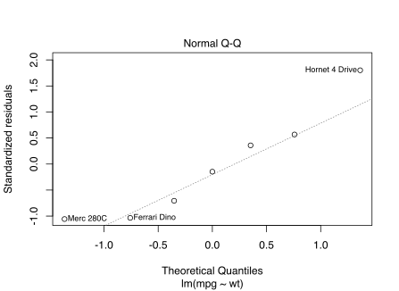

<!-- README.md is generated from README.Rmd. Please edit that file -->

# gestalt

The **gestalt** package provides a function composition operator,
`%>>>%`, which improves the clarity, modularity, and versatility of your
functions by enabling you to:

  - [Express complex functions as chains](#overview) of smaller, more
    readily intelligible functions

  - Directly manipulate a composite function as a list-like object, so
    that you can
    [inspect](#inspect-or-modify-using-higher-order-functions),
    [modify](#inspect-or-modify-using-higher-order-functions) or
    [repurpose](#repurpose-using-subset-assignment) any part of the
    chain of constituent functions

More importantly, gestalt fosters a powerful way of thinking about
[values as functions](#the-value-of-values-as-functions).

## Overview

The following example (adapted from the
[purrr](https://purrr.tidyverse.org) package) illustrates a function
that takes the name of a factor-column of the `mtcars` data frame, fits
a linear model to the corresponding groups, then computes the
R<sup>2</sup> of the summary.

``` r
library(gestalt)

fit <- mpg ~ wt

r2 <- {split(mtcars, mtcars[[.]])} %>>>%
  lapply(function(data) lm(!!fit, data)) %>>>%
  summarize: (
    lapply(summary) %>>>%
      stat: sapply(`[[`, "r.squared")
  )

r2("cyl")
#>         4         6         8 
#> 0.5086326 0.4645102 0.4229655
```

gestalt leverages the ubiquity of the
[magrittr](https://magrittr.tidyverse.org) `%>%` by adopting its syntax
to allow you to:

  - **Clarify intent** by annotating constituent functions with
    descriptive names, which also serve as [subsetting
    references](#repurpose-using-subset-assignment)

  - **Express nested sub-compositions**, while nonetheless preserving
    the runtime characteristics of a flattened composition

  - **Unquote sub-expressions** with the tidyverse
    [`!!`](http://rlang.r-lib.org/reference/quasiquotation.html)
    operator, to enforce immutability or spare a runtime computation

### `%>>>%` is not a pipe

Despite the syntax similarity, the `%>>>%` operator is fundamentally
different from the magrittr `%>%` operator. Whereas `%>%` ”pipes” a
value into a function to yield a value, `%>>>%` *composes* functions to
yield a function.

The main difference, however, is that the idioms of lists apply to
composite functions made by `%>>>%`, so that you inspect, modify, and
repurpose them in an intuitive way.

#### Select segments of functions using indexing

To select the first two functions in `r2` to get just the fitted model
(in this case, for cars with 6 cylinders), index with the vector `1:2`:

``` r
r2[1:2]("cyl")[["6"]]
#> 
#> Call:
#> lm(formula = mpg ~ wt, data = data)
#> 
#> Coefficients:
#> (Intercept)           wt  
#>       28.41        -2.78
```

#### Repurpose using subset-assignment

To compute the residuals rather than the R<sup>2</sup>, reassign the
summary-statistic function:

``` r
residuals <- r2
residuals$summarize$stat <- function(s) sapply(s, `[[`, "residuals")
residuals("cyl")[["6"]]
#>      Mazda RX4  Mazda RX4 Wag Hornet 4 Drive        Valiant       Merc 280 
#>     -0.1249670      0.5839601      1.9291961     -0.6896780      0.3547199 
#>      Merc 280C   Ferrari Dino 
#>     -1.0452801     -1.0079511
```

#### Inspect or modify using higher-order functions

Consider a function that capitalizes and joins a random selection of
characters:

``` r
scramble <- sample %>>>% toupper %>>>% paste(collapse = "")

set.seed(1)
scramble(letters, 5)
#> [1] "GJNUE"
```

You see the final result of the composition. But because `scramble()` is
list-like, we can also inspect its intermediate steps by modifying it
using a standard “map-reduce” strategy (i.e., higher-order function):

``` r
stepwise <- lapply(`%>>>%`, print) %>>>% compose
```

`stepwise()` maps over the constituent functions of a composite function
to add printing at each step:

``` r
set.seed(1)
stepwise(scramble)(letters, 5)
#> [1] "g" "j" "n" "u" "e"
#> [1] "G" "J" "N" "U" "E"
#> [1] "GJNUE"
```

## The [value of values](https://youtu.be/-6BsiVyC1kM) as functions

Whenever you have a value that results from a series of pipes, such as

``` r
library(magrittr)

R2 <- mtcars %>% 
  split(.$cyl) %>% 
  lapply(function(data) lm(mpg ~ wt, data)) %>% 
  lapply(summary) %>% 
  sapply(`[[`, "r.squared")

R2
#>         4         6         8 
#> 0.5086326 0.4645102 0.4229655
```

you can transpose it to a **constant composite function** that computes
the same value, simply by treating the input value as a constant
function and replacing each function application, `%>%`, by function
composition, `%>>>%`:

``` r
R2 <- {mtcars} %>>>% 
  split(.$cyl) %>>>%
  lapply(function(data) lm(mpg ~ wt, data)) %>>>%
  lapply(summary) %>>>%
  sapply(`[[`, "r.squared")
```

You reap a number of benefits by treating (piped) values as (composite)
functions:

1.  **Values as functions are lazy**. You can separate the value’s
    declaration from its point of use—the value is only computed on
    demand:
    
    ``` r
    R2()
    #>         4         6         8 
    #> 0.5086326 0.4645102 0.4229655
    ```

2.  **Values as functions are cheap**. You can cache the value of `R2`
    by declaring it as a constant:
    
    ``` r
    R2 <- constant(R2)
    R2()
    #>         4         6         8 
    #> 0.5086326 0.4645102 0.4229655
    
    microbenchmark::microbenchmark(R2(), times = 1e6)  
    #> Unit: nanoseconds
    #>  expr min  lq     mean median  uq      max neval
    #>  R2() 532 567 709.1435    585 647 39887308 1e+06
    ```

3.  **Values as functions encode their computation**. Since the
    composite function qua computation is a list-like object, you can
    compute on it to extract **latent information**.
    
    For instance, you can get the normal Q–Q plot of the fitted model
    for 6-cylinder cars from the head of `R2`:
    
    ``` r
    head(R2, 3)() %>% .[["6"]] %>% plot(2)
    ```
    
    

## Installation

``` r
# install.packages("devtools")
devtools::install_github("egnha/gestalt")
```


## License

MIT Copyright © 2018 [Eugene Ha](https://github.com/egnha)
