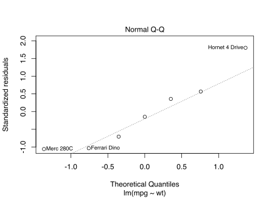

```{r setup, include = FALSE}
knitr::opts_chunk$set(
  collapse = TRUE,
  comment = "#>"
)
```

The **gestalt** package provides a function composition operator, `%>>>%`, which
improves the clarity, modularity, and versatility of your functions by enabling
you to:

 - [Express complex functions as chains](#overview) of smaller, more readily
   intelligible functions
   
 - Directly manipulate a composite function as a list-like object, so that you
   can [inspect](#inspect-or-modify-using-higher-order-functions),
   [modify](#inspect-or-modify-using-higher-order-functions), or
   [repurpose](#repurpose-using-subset-assignment) any part of the chain of
   constituent functions

More importantly, gestalt fosters a powerful way of thinking about
[values as functions](#the-value-of-values-as-functions).

## Overview

The following example (adapted from [purrr](https://purrr.tidyverse.org))
illustrates the use of `%>>>%` to express a function that takes the
name of a factor-column of the `mtcars` data frame, fits a linear model to the
corresponding groups, then computes the R² of the summary.

```{r}
library(gestalt)

fit <- mpg ~ wt

r2 <- {split(mtcars, mtcars[[.]])} %>>>%
  lapply(function(data) lm(!!fit, data)) %>>>%
  summarize: (
    lapply(summary) %>>>%
      stat: sapply(`[[`, "r.squared")
  )

r2("cyl")
```

gestalt leverages the ubiquity of the [magrittr](https://magrittr.tidyverse.org)
`%>%` operator, by adopting its semantics and augmenting it to enable you to:

 - **Clarify intent** by annotating constituent functions with descriptive names,
   which also serve as
   [subsetting references](#repurpose-using-subset-assignment)
   
 - **Express nested sub-compositions**, while nonetheless preserving the runtime 
   characteristics of a flattened composition, so you can focus on expressing
   structure that is most natural for your function
   
 - **Unquote sub-expressions** with the tidyverse
   [`!!`](http://rlang.r-lib.org/reference/quasiquotation.html) operator, to
   enforce immutability or spare a runtime computation

## Ceci n’est pas une `%>%`

Despite the syntactic similarity, the `%>>>%` operator is conceptually distinct
from the magrittr `%>%` operator. Whereas `%>%` “pipes” a value into a function
to yield a value, `%>>>%` _composes_ functions to yield a function.

The most significant distinction, however, is that list idioms apply to
composite functions made by `%>>>%`, so that you can inspect, modify, and
repurpose them, intuitively.

### Select segments of functions using indexing

To select the first two functions in `r2`, in order to get the fitted model,
index with the vector `1:2`:

```{r}
r2[1:2]("cyl")[["6"]]  # Cars with 6 cylinders
```

### Repurpose using subset-assignment

To compute the residuals rather than the R², reassign the summary-statistic
function:

```{r}
residuals <- r2
residuals$summarize$stat <- function(s) sapply(s, `[[`, "residuals")
residuals("cyl")[["6"]]
```
    
### Inspect or modify using higher-order functions

Consider a function that capitalizes and joins a random selection of characters:

```{r}
scramble <- sample %>>>% toupper %>>>% paste(collapse = "")

set.seed(1)
scramble(letters, 5)
```

Here you see the final result of the composition. But because `scramble` is a
list-like object, you can also inspect its intermediate steps by applying a
standard “map-reduce” strategy, such as the following higher-order function:

```{r}
stepwise <- lapply(`%>>>%`, print) %>>>% compose
```

`stepwise` maps over the constituent functions of a composite function to
add printing at each step:

```{r}
set.seed(1)
stepwise(scramble)(letters, 5)
```

## The [value of values](https://youtu.be/-6BsiVyC1kM) as functions

Whenever you have a value that results from a series of piped values, such as

```{r}
library(magrittr)

mtcars %>% 
  split(.$cyl) %>% 
  lapply(function(data) lm(mpg ~ wt, data)) %>% 
  lapply(summary) %>% 
  sapply(`[[`, "r.squared")
```

you can transpose it to a **constant composite function** that computes the same
value, simply by treating the input value as a constant function and replacing
each function application, `%>%`, by function composition, `%>>>%`:

```{r}
R2 <- {mtcars} %>>>% 
  split(.$cyl) %>>>%
  lapply(function(data) lm(mpg ~ wt, data)) %>>>%
  lapply(summary) %>>>%
  sapply(`[[`, "r.squared")
```

You gain power by treating (piped) values as (composite) functions:

 1. **Values as functions are lazy**. You can separate the value’s declaration
    from its point of use—the value is only computed on demand:
    ```{r}
    R2()
    ```
    
 2. **Values as functions are cheap**. You can cache the value of `R2` by
    declaring it as a constant:
    ```{r, eval = FALSE}
    R2 <- constant(R2)
    R2()
    #>         4         6         8 
    #> 0.5086326 0.4645102 0.4229655
    
    # On a 2016 vintage laptop
    microbenchmark::microbenchmark(R2(), times = 1e6)  
    #> Unit: nanoseconds
    #>  expr min  lq     mean median  uq      max neval
    #>  R2() 532 567 709.1435    585 647 39887308 1e+06
    ```
  
 2. **Values as functions encode their computation**. Since a composite function
    qua computation is a list-like object, you can compute on it to extract
    **latent information**.
    
    For instance, you can get the normal Q–Q plot of the fitted model for
    6-cylinder cars from the head of `R2`:
    ```{r, eval = FALSE}
    head(R2, 3)() %>% .[["6"]] %>% plot(2)
    ```
    

## Complements

In conjunction with `%>>>%`, gestalt also provides:

 - `fn`, a more concise and flexible variation of `function`, which supports
   tidyverse
   [quasiquotation](http://rlang.r-lib.org/reference/quasiquotation.html).
    ```{r}
    size <- 5L
    
    fn(x, ... ~ sample(x, !!size, ...))
    ```
    
 - `partial`, to make new functions from old by fixing a number of arguments,
   i.e.,
   [partial application](https://en.wikipedia.org/wiki/Partial_application).
   Like `fn`, it also supports 
   [quasiquotation](http://rlang.r-lib.org/reference/quasiquotation.html).
    ```{r}
    (draw <- partial(sample, size = !!size, replace = TRUE))
    
    set.seed(2)
    draw(letters)
    ```
    Additionally, `partial` is:
    
    * **Hygenic**: The fixed argument values are
      [tidily evaluated](http://rlang.r-lib.org/reference/eval_tidy.html)
      promises; in particular, the usual lazy behavior of function arguments,
      which can be overridden via unquoting, is respected even for fixed
      arguments.
      
    * **Flat**: Fixing arguments in stages is _operationally_ equivalent to
      fixing them all at once—you get the same function either way:
        ```{r}
        partial(partial(sample, replace = TRUE), size = 5L)
        ```
 
See the package documentation for more details (`help(package = gestalt)`).

## Acknowledgments

 - The core semantics of `%>>>%` conform to those of the 
   [magrittr](https://magrittr.tidyverse.org) `%>%` operator developed by
   [Stefan Milton Bache](https://github.com/smbache).
   
 - The engine for quasiquotation and expression capture is powered by the
   [rlang](https://rlang.r-lib.org) package by
   [Lionel Henry](https://github.com/lionel-) and
   [Hadley Wickham](https://github.com/hadley).
   
 - The “triple arrow” notation for the composition operator is taken from the
   Haskell
   [Control.Arrow](https://hackage.haskell.org/package/base/docs/Control-Arrow.html)
   library by Ross Paterson.
